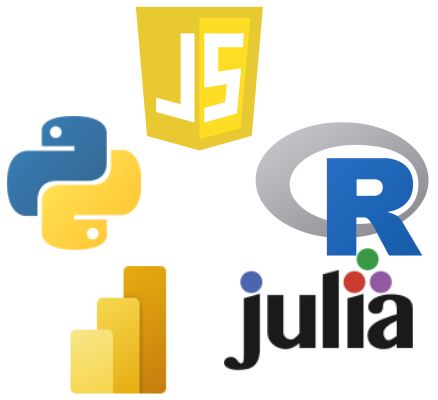

<b><a href="/de_dcm">DE</a> | EN</b>

## What?
A virtual event series where data analytics experts show their skills by live-crunching some data.
The demonstrate how their favorite tool or programming language is best utilized.
Everyone is invited to interact with the expert, ask questions and join the discussion.

We strive to be an open and inclusive community, everyone is welcome! We have a [code of conduct](./CodeOfConduct) that we adhere to.

## Who?
Everyone is welcome to join, whether you are a student, researcher or practitioner from industry. Also all experience levels, backgrounds and tool preferences are welcome!
As this event is supported by the ESF-ZDEX project, it is free of charge also if you are not a member of the University. See details [below in the ESF-ZDEX section](#esf-zdex).

Are you interested in presenting, yourself? Awesome! Just send a mail to [Markus Ankenbrand](mailto:markus.ankenbrand@uni-wuerzburg.de).

## When and where?

Thursdays at 6pm in Zoom (online).
The exact dates depend on the availability of expert presenters and will be announced here.
All details, including the zoom link will also be posted here.
The regular duration of a Data Crunch Magic Event is 90 minutes.



## Are the Data Crunch Magic Events in German or English?

This is decided by the respective expert. So it might change from time to time but it will always be anounced beforehand.

## Topics

There are many tools and languages for data analysis out there. Each has unique strengths and limitations. We let experts demonstrate how to best use their favorite tools. They do it by analyzing a real dataset live.
It is also possible to interact with the experts and other participants, to ask questions, and to discuss.

We are currently planning events with at least these tools:
- R
- julia
- python
- JavaScript
- Microsoft PowerBI

## Related Events

- [Data Dojo](https://ddojo.github.io/): Training data analytics skills together.
- [HackyHour](https://hackyhour.github.io/Wuerzburg): A social get-together to solve compuntational problems and explore computers in a fun and interactive manner.
- [TidyTuesday](https://github.com/rfordatascience/tidytuesday): A weekly social data project in R.

## ESF-ZDEX

Data Crunch Magic is supported by the <a href="https://www.uni-wuerzburg.de/sft/esf-zdex/">ESF ZDEX project</a>.
If your employer is already a partner in the ESF-ZDEX project, the only thing you need to do is: let Markus Ankenbrand know at the beginning of the event.
He will take care of the administrative obligations (confirmation of attendance, questionaire for first time participants (only if it is your very first ESF ZDEX event)).
If your company is not yet partner in the ESF-ZDEX project you can find more information and instructions for joining the network [here](https://www.uni-wuerzburg.de/sft/esf-zdex/).
This offer is available, free of charge for small and medium sized companies in northern Bavaria. The only requirement is signing a cooperation agreement once.
[Markus Ankenbrand](mailto:markus.ankenbrand@uni-wuerzburg.de) is happy to answer any questions you might have.

# License
The content of this website is available under [CC0](LICENSE).
This website uses the [cayman template](https://github.com/pages-themes/cayman) which is also available under [CC0](https://creativecommons.org/publicdomain/zero/1.0/legalcode).
