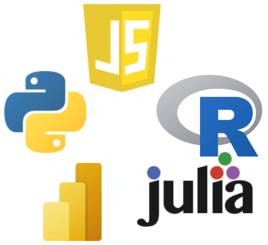

<!-- 
<b>DE | <a href="/">EN</a></b>
 -->

## Was?
Eine virtuelle Veranstaltungsreihe bei der Datenanalyse Expert\*innen live einen Datensatz analysieren. Dabei demonstrieren sie jeweils wie man ein bestimmtes Tool oder eine Programmiersprache optimal einsetzt. Alle Teilnehmer\*innen sind herzlich eingeladen mit den Vortragenden zu interagieren, mitzumachen und anschließend zu diskutieren.

Es gilt wie immer unser [Code of Conduct](./de_CodeOfConduct).

## Wer?
Teilnehmen kann jede\*r, egal ob Student\*in, Wissenschaftler\*in oder Anwender\*in in einem Unternehmen, alle sind herzlich eingeladen. Dank der Unterstützung durch das ESF-ZDEX Projekt können auch Mitarbeiter\*innen von Unternehmen kostenfrei an den Veranstaltungen teilnehmen, bitte die [Details unten unter ESF-ZDEX](#esf-zdex) beachten.

Wenn Sie Interesse haben selbst zu präsentieren, melden Sie sich einfach bei [Markus Ankenbrand](mailto:markus.ankenbrand@uni-wuerzburg.de).

## Wann und wo?

Voraussichtlich Donnerstag um 18:00 Uhr in Zoom (online).
Die Termine werden individuell mit den Vortragenden vereinbart und hier bekannt gegeben.
Details und der Zoom Link zu jeder Veranstaltung werden ebenfalls jeweils hier veröffentlicht.



## Sind die Data Crunch Magic Events auf Deutsch oder Englisch?

Das entscheidet die jeweilige Expert\*in. Das kann sich also immer ändern, wird aber im Voraus angekündigt.

## Themen

Es gibt viele Werkzeuge und Sprachen um Daten zu analysieren. Jede hat besondere Stärken und Schwächen. Wir lassen uns jeweils von Expert\*innen zeigen wie sie ihr Werkzeug optimal verwenden. Dabei wird immer ein echter Datensatz von Grund auf live analysiert.
Außerdem gibt es die Möglichkeit mit den Expert\*innen und anderen Teilnehmer\*innen zu interagieren, zu diskutieren und Fragen zu stellen.

Zu den Tools zu denen bereits Events geplant sind gehören:
- R
- julia
- python
- JavaScript
- Microsoft PowerBI

## Weitere Veranstaltungen

- [Data Dojo](https://ddojo.github.io/de): Zusammen mit anderen die Datenanalyse Fähigkeiten trainieren.
- [HackyHour](https://hackyhour.github.io/Wuerzburg): Ein soziales Treffen um gemeinsam Probleme mit Computermethoden zu lösen oder einfach Spaß damit zu haben.
- [TidyTuesday](https://github.com/rfordatascience/tidytuesday): Jede Woche gibt es einen neuen öffentlichen Datensatz.

## ESF-ZDEX

Data Crunch Magic wird vom <a href="https://www.uni-wuerzburg.de/sft/esf-zdex/">ESF ZDEX Projekt</a> unterstützt.
Das heißt, falls Ihr Unternehmen bereits Partner im ESF-ZDEX Projekt ist brauchen Sie nichts weiter zu tun als am Anfang der Veranstaltung Markus Ankenbrand Bescheid zu geben.
Er kümmert sich dann um den Aktionsnachweis und ggf. den einmaligen Teilnehmendenfragebogen.
Sollten Ihr Unternehmen noch kein Partner im ESF-ZDEX Projekt sein können Sie sich [hier](https://www.uni-wuerzburg.de/sft/esf-zdex/) informieren und anmelden. 
Das Angebot ist für KMU in Nordbayern kostenlos und erfordert lediglich das einmalige Ausfüllen einer Kooperationsvereinbarung.
Bei allen Fragen steht ihnen [Markus Ankenbrand](mailto:markus.ankenbrand@uni-wuerzburg.de) sehr gerne zur Verfügung.

## Lizenz
Der Inhalt dieser Website steht unter einer [CC0 Lizenz](LICENSE).
Die Webseite verwendet das [Cayman Template](https://github.com/pages-themes/cayman) welches ebenfalls unter [CC0 Lizenz](https://creativecommons.org/publicdomain/zero/1.0/legalcode) steht.
